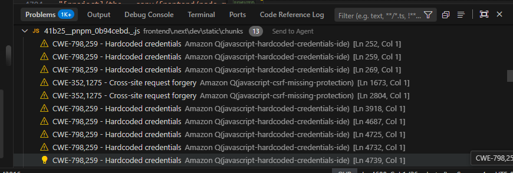

# The Copy - Drama Analysis Platform

<div align="center">



**Advanced AI-Powered Drama Analysis Platform**

[Features](#features) • [Getting Started](#getting-started) • [Architecture](#architecture) • [Testing](#testing) • [Contributing](#contributing) • [License](#license)

</div>

---

## 📊 Test Coverage

### Frontend Coverage

[](./frontend/coverage) 
[](./frontend/coverage)
[](./frontend/coverage)
[](./frontend/coverage)

**Target Thresholds:** Lines 85% • Functions 85% • Branches 80% • Statements 85%

### Backend Coverage

[](./backend/coverage)
[](./backend/coverage)
[](./backend/coverage)
[](./backend/coverage)

**Target Thresholds:** Lines 85% • Functions 85% • Branches 80% • Statements 85%

---

## 🚀 Quick Start

### Prerequisites

- **Node.js:** 20.x LTS or higher
- **pnpm:** 10.0.0 or higher
- **PostgreSQL:** 15.0 or higher
- **Redis:** 5.9.0 or higher

### Installation

```bash
# Clone the repository
git clone https://github.com/your-org/the-copy.git
cd the-copy

# Install dependencies using pnpm
pnpm install

# Set up environment variables
cp .env.example .env.local

# Run database migrations
cd backend
pnpm db:push
cd ..

# Start development servers
pnpm dev
```

The application will be available at:
- **Frontend:** http://localhost:5000
- **Backend API:** http://localhost:3001
- **Storybook:** http://localhost:6006

---

## 🏗️ Architecture

### Monorepo Structure

```
the-copy/
├── frontend/              # Next.js 15 Application
│   ├── src/
│   │   ├── app/          # App Router pages
│   │   ├── components/   # React components
│   │   ├── lib/          # Utilities and helpers
│   │   ├── hooks/        # Custom React hooks
│   │   └── __tests__/    # Integration tests
│   └── vitest.config.ts  # Test configuration
│
├── backend/              # Express.js API
│   ├── src/
│   │   ├── controllers/  # Request handlers
│   │   ├── services/     # Business logic
│   │   ├── middleware/   # Express middleware
│   │   ├── routes/       # API routes
│   │   ├── db/           # Database layer (Drizzle ORM)
│   │   └── test/         # Integration tests
│   └── vitest.config.ts  # Test configuration
│
├── scripts/              # Build and utility scripts
├── docs/                 # Project documentation
├── monitoring/           # Monitoring and logging setup
└── package.json          # Root workspace configuration
```

### Tech Stack

#### Frontend
- **Framework:** Next.js 15.4.7
- **Language:** TypeScript 5.7.2
- **Styling:** Tailwind CSS 4.1.16
- **UI Components:** Radix UI
- **State Management:** TanStack Query 5.90.6
- **Validation:** Zod 3.25.76
- **Testing:** Vitest, Testing Library, Playwright

#### Backend
- **Runtime:** Node.js 20+ LTS
- **Framework:** Express.js 4.18.2
- **Language:** TypeScript 5.0+
- **Database:** PostgreSQL 15 (Neon Serverless)
- **ORM:** Drizzle ORM 0.44.7
- **Caching:** Redis 5.9.0
- **Job Queue:** BullMQ 5.63.0
- **AI:** Google Gemini API
- **Testing:** Vitest, Supertest

---

## 🧪 Testing

### Running Tests

```bash
# Frontend tests
cd frontend
pnpm test              # Run unit tests
pnpm test:coverage     # Run with coverage report
pnpm test:watch        # Watch mode
pnpm test:ui           # UI mode with Vitest UI
pnpm e2e               # Run end-to-end tests

# Backend tests
cd backend
pnpm test              # Run unit tests
pnpm test:coverage     # Run with coverage report
pnpm test:watch        # Watch mode

# All tests
pnpm test              # From root
pnpm test:all          # All tests with coverage
```

### Coverage Requirements

Both frontend and backend enforce strict coverage thresholds:

| Metric | Target | Enforcement |
|--------|--------|-------------|
| **Lines** | 85% | Fail CI if below |
| **Functions** | 85% | Fail CI if below |
| **Branches** | 80% | Fail CI if below |
| **Statements** | 85% | Fail CI if below |

Coverage reports are generated in:
- Frontend: `frontend/coverage/` and `frontend/reports/coverage/`
- Backend: `backend/coverage/`

### Test Categories

#### Unit Tests
Tests for individual functions and components in isolation.

```bash
# Run specific test file
pnpm test -- src/lib/utils.test.ts

# Run tests matching pattern
pnpm test -- --grep "utility"
```

#### Integration Tests
Tests for component and API interactions.

Location:
- Frontend: `src/__tests__/integration/`
- Backend: `src/test/integration/`

#### End-to-End Tests
Full user workflows using Playwright.

```bash
# Run E2E tests
cd frontend
pnpm e2e

# Run with UI
pnpm e2e:ui

# Run headed (visible browser)
pnpm e2e:headed
```

### Coverage Reports

Coverage reports are automatically generated during test runs:

```bash
# View HTML coverage report
cd frontend
open reports/coverage/index.html

cd ../backend
open coverage/index.html
```

### CI/CD Coverage Validation

The CI pipeline automatically:

1. ✅ Runs all tests with coverage collection
2. ✅ Checks coverage against thresholds
3. ✅ Comments on PRs with coverage results
4. ✅ Uploads reports to Codecov
5. ✅ Fails builds if thresholds not met

---

## 🔒 Security

### Security Features

- ✅ Input validation with Zod schemas
- ✅ SQL injection prevention via parameterized queries
- ✅ XSS protection with DOMPurify and React escaping
- ✅ CSRF tokens for state-changing operations
- ✅ Rate limiting on API endpoints
- ✅ JWT-based authentication
- ✅ HTTPS/TLS encryption
- ✅ Environment variable validation

### Best Practices

- Never commit secrets to the repository
- Use `.env.example` for required variables
- Rotate credentials regularly
- Enable 2FA on GitHub and production access
- Review dependencies: `pnpm audit`

---

## 📈 Performance

### Optimization Strategies

1. **Frontend**
   - Dynamic imports for code splitting
   - Image optimization with `next/image`
   - React Query caching
   - Memoization with `useMemo` and `useCallback`
   - CSS-in-JS with Tailwind

2. **Backend**
   - Database query optimization
   - Redis caching for expensive operations
   - Connection pooling
   - Compression middleware
   - CDN integration

3. **Monitoring**
   - Sentry for error tracking
   - Prometheus for metrics
   - Grafana for dashboards
   - Performance monitoring

---

## 🚀 Deployment

### Production Deployment

See [PRODUCTION_DEPLOYMENT_SETUP.md](./PRODUCTION_DEPLOYMENT_SETUP.md) for comprehensive deployment instructions.

Quick deployment:

```bash
# Build for production
pnpm build

# Deploy using blue-green strategy
bash scripts/deploy-production.sh blue

# Switch traffic to new version
bash scripts/switch-traffic-to-green.sh
```

### Staging Environment

```bash
# Deploy to staging
bash scripts/deploy-staging.sh

# Run staging validation
pnpm test:staging
```

---

## 📚 Documentation

- [Architecture Documentation](./docs/architecture/)
- [API Documentation](./backend/openapi.yaml)
- [Database Schema](./backend/src/db/schema.ts)
- [Deployment Guide](./PRODUCTION_DEPLOYMENT_SETUP.md)
- [Performance Optimization](./docs/performance-optimization/)
- [Monitoring Setup](./MONITORING_SETUP.md)

---

## 🤝 Contributing

### Development Workflow

1. **Create Feature Branch**
   ```bash
   git checkout -b feature/your-feature-name
   ```

2. **Make Changes**
   - Follow code style guidelines
   - Write tests for new features
   - Keep commits atomic and descriptive

3. **Run Quality Checks**
   ```bash
   pnpm lint
   pnpm typecheck
   pnpm test
   pnpm test:coverage
   ```

4. **Create Pull Request**
   - Reference related issues
   - Provide clear description
   - Ensure CI passes
   - Request review from team

### Code Standards

- **TypeScript:** Strict mode enabled
- **ESLint:** All warnings must be resolved
- **Prettier:** Automatic code formatting
- **Coverage:** 85% minimum (lines, functions, statements), 80% branches

### Commit Message Format

Follow Conventional Commits:

```
type(scope): brief description

Detailed explanation of changes (if needed).

Fixes #123
```

Types: `feat`, `fix`, `docs`, `style`, `refactor`, `perf`, `test`, `chore`

---

## 📋 Project Status

### Current Phase

- ✅ Core architecture complete
- ✅ API endpoints implemented
- ✅ UI components built
- ✅ Testing framework configured
- ✅ CI/CD pipeline active
- 🔄 Production deployment in progress

### Roadmap

- [ ] Advanced analytics dashboard
- [ ] Real-time collaboration features
- [ ] Mobile app (React Native)
- [ ] Enhanced AI capabilities
- [ ] Community features

---

## 🐛 Reporting Issues

If you find a bug, please create an issue with:

1. Clear title describing the problem
2. Steps to reproduce
3. Expected vs actual behavior
4. Environment details
5. Screenshots/logs if applicable

---

## 📞 Support

For questions and support:

- **GitHub Issues:** [Project Issues](https://github.com/your-org/the-copy/issues)
- **Discussions:** [GitHub Discussions](https://github.com/your-org/the-copy/discussions)
- **Email:** support@thecopy.app

---

## 📄 License

This project is licensed under the MIT License - see [LICENSE](./LICENSE) file for details.

---

## 🙏 Acknowledgments

Built with ❤️ by the The Copy team

Special thanks to:
- The open-source community
- Our contributors and users
- The drama and storytelling communities

---

<div align="center">

Made with 💡 Intelligence and 🎭 Creativity

[GitHub](https://github.com/your-org/the-copy) • [Website](https://thecopy.app) • [Documentation](./docs)

</div>
